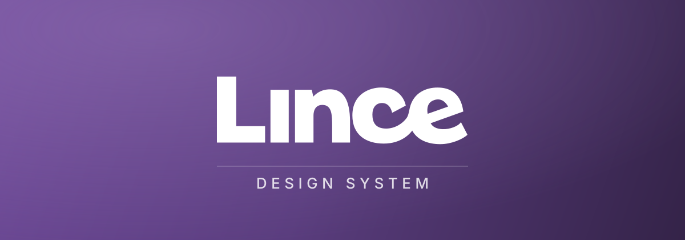

<p align="center">
  
</p>

<p align="center">
  Os tokens visuais e a casca de navegação da Lince, em um lugar só.
</p>

<p align="center">
  
  
  
  
</p>

---

## Instalação

```bash
bun add github:LinceCorp/lince-design-system#v0.1.1
```

## Os tokens

Uma linha no CSS de entrada:

```css
@import "@lincecorp/design-system/theme.css";
```

Ela traz o Tailwind, o variant de tema escuro e os dez arquivos de token. Para
mexer num assunto isolado, importe só ele:

```css
@import "@lincecorp/design-system/tokens/raios.css";
```

| Arquivo | O que guarda |
|---|---|
| `marca.css` | o roxo da marca e a lavagem da tela de entrada |
| `tipografia.css` | as famílias e sete degraus nomeados por papel |
| `raios.css` | a escala `xs`–`xl` e os apelidos por papel |
| `sombras.css` | quatro níveis de elevação, um par por tema |
| `movimento.css` | durações e curva, que zeram sozinhas em `prefers-reduced-motion` |
| `camadas.css` | a escala de `z-index` e as larguras da casca |
| `superficies.css` | fundo, superfície, texto, linha e acento |
| `estado.css` | sucesso, aviso, erro e informação |
| `dominio.css` | cor que significa um dado, não um estado de interface |
| `base.css` | corpo, títulos, foco visível e o autofill do Chrome |

Cada par claro/escuro é declarado **uma vez**, com `light-dark()`. Duas listas
mantidas em paralelo divergem no primeiro token que alguém esquece.

## A casca

```tsx
import { AppShell, type NavModel } from "@lincecorp/design-system";
import { FileText, Wrench } from "lucide-react";

const nav: NavModel = {
  groups: [{ id: "trabalho", label: "Trabalho" }],
  items: [
    { group: "trabalho", to: "/laudos", label: "Laudos", icon: FileText, bottom: true, end: true },
    { group: "trabalho", to: "/ordens", label: "Ordens", icon: Wrench, bottom: true },
  ],
};

<AppShell
  nav={nav}
  logo={<Logotipo />}
  marcaCompacta="L"
  perfil={{ nome, email, aoSair }}
  tema={{ resolvido, alternar }}
  fixada={fixada}
  aoAlternarFixada={alternarFixada}
>
  <Outlet />
</AppShell>
```

Barra lateral colapsável com fixação e expansão no passar do mouse, gaveta no
celular que é diálogo modal de verdade, barra superior, barra inferior, salto
para o conteúdo e devolução de foco.

A casca **não conhece contexto nenhum**. Autenticação, tema, papéis e
persistência entram por prop:

> O pacote é dono de **layout, comportamento e aparência**.
> O produto é dono de **conteúdo e política**.

`filtrarItem` é apresentação, nunca controle de acesso — esconder um item não
protege a rota.

## Desenvolvimento

```bash
bun install
bun run test              # Vitest + Testing Library
bun run tokens:contraste  # WCAG AA em todo par token × superfície
bun run tokens:usados     # token referenciado que não existe
bun run build             # ESM + .d.ts
bun run ci                # tudo acima
```

O `dist/` é **versionado**: instalar por tag não roda passo de build, e o portão
falha se ele divergir do fonte.

O contraste não é conferido a olho. `tokens:contraste` mede cada cor de texto
contra cada superfície, nos dois temas, compondo o alfa antes de medir, e
reprova abaixo de 4,5:1.

## Versionamento

Tag semver, aplicada depois de `bun run ci` passar. **Minor** para token novo ou
valor alterado; **major** para token removido ou assinatura de componente
mudada. O `CHANGELOG.md` diz o que muda de **aparência**, não só o que muda de
código.
